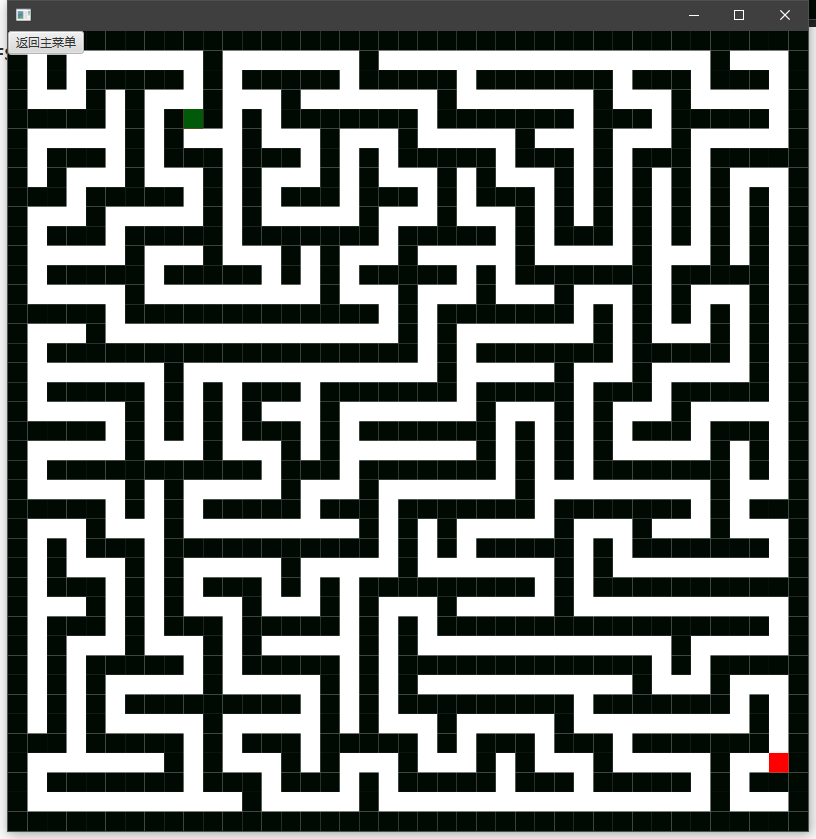

## 项目一：迷宫求解

#### a)需求分析：

##### 要求

可以输入一个任意大小的迷宫数据，用非递归的方法求出一条走出迷宫的路径，并将路径输出

#### b)概要设计：

##### 思路

- 我打算设计一个迷宫游戏，用不同的算法生成迷宫，再用不同算法作路径规划
- 非递归的方法排除dfs路径规划方法
- 制作成可视化的程序

*   实现BFS算法寻找迷宫终点
*   实现基本的地图及寻找路径可视化

 *   实现prim迷宫生成算法
 *   改进BFS算法
 *   独立出地图绘制类，供不同算法使用
 *   封装主地图类
 *   封装节点类

 *   启用Scene Builder工具编写界面-
 *   实现基本的UI界面
 *   封装所有页面，改写为ButtonChose类的方法，实现页面跳转
 *   加入DFS迷宫生成算法

- 重构MainMap类及其子类
- 重构bfs寻路算法
- 加入AStar寻路算法
- 加入bfs寻路算法


##### 项目整体的设置思路图


##### 一些数据结构设计图


##### 设计说明：

该项目被我设计了一个迷宫游戏，玩家可以通过选择界面对迷宫的大小尺寸，迷宫的生成方式，起点与终点，屏幕分辨率等等属性进行时设置

点击开始游戏后，游戏会根据玩家的设置根据相应算法生成迷宫，玩家可以通过aswd四个键位操作角色走迷宫。

玩家可以通过按键J来使用BFS算法实时实现路径规划（显示角色到终点的路径，实时运算）

玩家可以通过按键L来使用AStar算法实时实现路径规划（显示角色到终点的路径，实时运算）

玩家可以通过按键K来进行角色导航（显示角色到终点的行走动画，实时运算，默认BFS算法）

##### 算法的设计有：

1. 随机prim迷宫生成算法
2. 随机dfs迷宫生成算法
3. AStar路径规划算法
4. BFS路径规划算法

##### 用到的数据结构有：

1. 链表
2. 队列
3. 双端队列
4. 栈
5. 优先队列
6. 广义表
7. 数组
8. 树

#### c）详细设计：

##### 地图的每个点--Node类的设计

```java
class Node {
    int FValue;//总代价
    int HValue;//预估代价 当前点到终点的的代价
    int GValue;//当前代价 当前点到起点的代价

    int x, y;//x坐标，y坐标
    int pre;//上个节点
    int id = 0;//编号
    boolean isVisited=false;//是否访问
    int value=1;//1是墙，0是路
    public Node(){
    }
    public Node(int x, int y, int pre) {
        this.x = x;
        this.y = y;
        this.pre = pre;

    }
    public Node(int x, int y) {
        this.x = x;
        this.y = y;
    }
    public int getX() {
        return x;
    }
    public void setX(int x) {
        this.x = x;
    }
    public int getY() {
        return y;
    }
    public void setY(int y) {
        this.y = y;
    }
    public int getPre() {
        return pre;
    }
    public void setPre(int pre) {
        this.pre = pre;
    }
    public void setId(int id) {
        this.id = id;
    }
    public int getId() {
        return id;
    }
    public boolean isVisited() {
        return isVisited;
    }
    public void setVisited(boolean visited) {
        isVisited = visited;
    }
    public int getValue() {
        return value;
    }
    public void setValue(int value) {
        this.value = value;
    }
    public void setHValue(Node end) {
           HValue= Math.abs(x-end.getX())+Math.abs(y- end.getY());
    }
    public void setGValue(Node start) {
        //曼哈顿计算G值
        HValue= Math.abs(x-start.getX())+Math.abs(y- start.getY());
    }
    public int getFValue() {
        FValue=HValue+GValue;
        return FValue;
    }

    @Override
    public String toString(){
        return new String(x+" "+y);
    }
}
```

##### 迷宫生成算法接口的设计

```java
public class MainMap {
    protected Node start;//起点
    protected Node end;//终点
    protected int col;//列数
    protected int row;//行数
    protected Node nodeMap[][];//地图

    public int getCol() {
        return col;
    }

    public void setCol(int col) {
        this.col = col;
    }

    public int getRow() {
        return row;
    }

    public void setRow(int row) {
        this.row = row;
    }

    public MainMap(int col, int row) {
        this.col = col;
        this.row = row;
        nodeMap=new Node[row][col];

    }

    //初始化
    public void InitMap(){
        // 设置全为墙
        for (int i=0;i<row;i++){
            for (int j=0;j< col;j++){
                Node temp=new Node(i,j);
                nodeMap[i][j]=temp;
            }
        }


        /**随机生成起点和终点
         * 避免起点和终点靠得太近，将地图四分起点只在左上生成，终点在右下生成
         * 起点和终点不能同时在边界处
         */
        start=new Node(((int)(Math.random()*row/2+1)),((int)(Math.random()*col/2+1)));
//        System.out.println("开始点"+start.getX()+" "+start.getY());

        end=new Node((int)((Math.random()*row)/2+row/2),(int)((Math.random()*col))/2+col/2);


    }

    public void makeMap(){

    }

    public Node getStart() {
        return start;
    }

    public void setStart(Node start) {
        this.start = start;
    }

    public Node getEnd() {
        return end;
    }

    public void setEnd(Node end) {
        this.end = end;
    }

    public void showMap(){
        System.out.println("起点："+start.getX()+" "+start.getY());
        System.out.println("终点："+end.getX()+" "+end.getY());
        for (int i=0;i<row;i++){
            for (int j=0;j< col;j++){
                System.out.print(nodeMap[i][j].value +" ");
            }
            System.out.println();
        }
    }


    //制作副本
    public MainMap clone(){
        MainMap clone =new MainMap(col,row);
        clone.InitMap();
        for(int i=0;i<row;i++){
            for(int j=0;j<col;j++){
                clone.nodeMap[i][j].setValue(nodeMap[i][j].getValue());
                clone.nodeMap[i][j].setPre(nodeMap[i][j].getPre());
                clone.nodeMap[i][j].setVisited(nodeMap[i][j].isVisited());
                clone.nodeMap[i][j].setX(nodeMap[i][j].getX());
                clone.nodeMap[i][j].setY(nodeMap[i][j].getY());
                clone.nodeMap[i][j].setId(nodeMap[i][j].getId());
            }
        }
        clone.end=end;
        clone.start=start;
        return clone;
    }

}
```

##### 地图接口设计

```java
public class MainMap {
    protected Node start;//起点
    protected Node end;//终点
    protected int col;//列数
    protected int row;//行数
    protected Node nodeMap[][];//地图

    public int getCol() {
        return col;
    }

    public void setCol(int col) {
        this.col = col;
    }

    public int getRow() {
        return row;
    }

    public void setRow(int row) {
        this.row = row;
    }

    public MainMap(int col, int row) {
        this.col = col;
        this.row = row;
        nodeMap=new Node[row][col];

    }

    //初始化
    public void InitMap(){
        // 设置全为墙
        for (int i=0;i<row;i++){
            for (int j=0;j< col;j++){
                Node temp=new Node(i,j);
                nodeMap[i][j]=temp;
            }
        }


        /**随机生成起点和终点
         * 避免起点和终点靠得太近，将地图四分起点只在左上生成，终点在右下生成
         * 起点和终点不能同时在边界处
         */
        start=new Node(((int)(Math.random()*row/2+1)),((int)(Math.random()*col/2+1)));
//        System.out.println("开始点"+start.getX()+" "+start.getY());

        end=new Node((int)((Math.random()*row)/2+row/2),(int)((Math.random()*col))/2+col/2);


    }

    public void makeMap(){

    }

    public Node getStart() {
        return start;
    }

    public void setStart(Node start) {
        this.start = start;
    }

    public Node getEnd() {
        return end;
    }

    public void setEnd(Node end) {
        this.end = end;
    }


    public void showMap(){
        System.out.println("起点："+start.getX()+" "+start.getY());
        System.out.println("终点："+end.getX()+" "+end.getY());
        for (int i=0;i<row;i++){
            for (int j=0;j< col;j++){
                System.out.print(nodeMap[i][j].value +" ");
            }
            System.out.println();
        }
    }

    //制作副本
    public MainMap clone(){
        MainMap clone =new MainMap(col,row);
        clone.InitMap();
        for(int i=0;i<row;i++){
            for(int j=0;j<col;j++){
                clone.nodeMap[i][j].setValue(nodeMap[i][j].getValue());
                clone.nodeMap[i][j].setPre(nodeMap[i][j].getPre());
                clone.nodeMap[i][j].setVisited(nodeMap[i][j].isVisited());
                clone.nodeMap[i][j].setX(nodeMap[i][j].getX());
                clone.nodeMap[i][j].setY(nodeMap[i][j].getY());
                clone.nodeMap[i][j].setId(nodeMap[i][j].getId());
            }
        }
        clone.end=end;
        clone.start=start;
        return clone;
    }
}
```

##### 路径规划算法接口设计

```java
public interface SF {
    public LinkedList<Node> find3();
}
```

##### Prim随机生成地图算法原理与代码

1.让迷宫全是墙.
2.选一个单元格作为迷宫的通路，然后把它的邻墙放入列表
3.当列表里还有墙时
	1.从列表里随机选一个墙，如果这面墙分隔的两个单元格只有一个单元格被访问过
		1.那就从列表里移除这面墙，即把墙打通，让未访问的单元格成为迷宫的通路
		2.把这个格子的墙加入列表
	2.如果墙两面的单元格都已经被访问过，那就从列表里移除这面墙

```java
public void makeMap(){
    InitMap();
    nodeMap[1][1].setValue(0);//将起点变成路

    LinkedList<Node> listA=new LinkedList<>();
    LinkedList<Node> listB= null;
    int tempR = 0;
    int tempC = 0;
    //待选路点进入链表
    Node temp=nodeMap[1][3];
    listA.add(temp);
    temp=nodeMap[3][1];
    listA.add(temp);

    while (listA.size()!=0){

        int randomNodeId=(int)(listA.size()*Math.random());//随机备选点作为A
        Node randomA=listA.get(randomNodeId);//随机路点A
        listB=new LinkedList<>();
        boolean flag=true;
        //将选路点A四周是路的进入备选池
        for (int i=0;i<4;i++){
            switch (i){
                case 0:tempR=randomA.getX()-2;tempC=randomA.getY();break;
                case 1:tempR=randomA.getX()+2;tempC=randomA.getY();break;
                case 2:tempR=randomA.getX();tempC=randomA.getY()+2;break;
                case 3:tempR=randomA.getX();tempC=randomA.getY()-2;break;
            }
            if(!(tempC<col&&tempC>=0&&tempR>=0&&tempR<row)){
                continue;
            }
            //判断是否通路    加入临时通路备选池B
            if(nodeMap[tempR][tempC].getValue()==0){
                temp=nodeMap[tempR][tempC];
                listB.add(temp);// listB其实用数组更好 ，大小只有0-3 有1个是来的点，肯定访问过了
            }
            //判断是否为墙和A中是否包含该点加入 待选路点链表listA
            else if(nodeMap[tempR][tempC].getValue()==1&&!listA.contains(nodeMap[tempR][tempC])){
                    temp=nodeMap[tempR][tempC];
                    listA.add(temp);
            }
        }

        int randomPass=(int)(listB.size()*Math.random());//随机备选点作为B
        Node randomB=listB.get(randomPass);//随机通路点
        //打通一条通路
        nodeMap[randomA.getX()][randomA.getY()].setValue(0);
        nodeMap[(randomB.getX()+randomA.getX())>>1][(randomA.getY()+randomB.getY())>>1].setValue(0);
        listA.remove(randomA);
    }

    //确保生成一个可达的终点
    while (nodeMap[end.getX()][end.getY()].getValue()==1){
        end=new Node((int)((Math.random()*row)/2+row/2),(int)((Math.random()*col))/2+col/2);
    }
}
```


##### DFS随机生成地图算法原理与代码

1.将起点作为当前迷宫单元并标记为已访问
2.当还存在未标记的迷宫单元，进行循环
	1.如果当前迷宫单元有未被访问过的的相邻的迷宫单元
		1.随机选择一个未访问的相邻迷宫单元
		2.将当前迷宫单元入栈
		3.移除当前迷宫单元与相邻迷宫单元的墙
		4.标记相邻迷宫单元并用它作为当前迷宫单元
	2.如果当前迷宫单元不存在未访问的相邻迷宫单元，并且栈不空
		1.栈顶的迷宫单元出栈
		2.令其成为当前迷宫单元

```java
    public void makeMap(){
        InitMap();
        LinkedList<Node> stackList=new LinkedList<>();

//        1.将起点作为当前迷宫单元并标记为已访问
        Node current=nodeMap[1][1];
        nodeMap[1][1].setVisited(true);
        stackList.add(current);

//        2.当还存在未标记的迷宫单元，进行循环
        while(stackList.size()!=0) {

            //遍历4个方向
            int tempR=0;
            int tempC=0;
            LinkedList<Node> AdjList=new LinkedList<>();
            for(int i=0;i<4;i++){
                switch (i){
                    case 0:tempR=current.getX()-2;tempC=current.getY();break;
                    case 1:tempR=current.getX()+2;tempC=current.getY();break;
                    case 2:tempR=current.getX();tempC=current.getY()+2;break;
                    case 3:tempR=current.getX();tempC=current.getY()-2;break;
                }
                //处理边界问题
                if(!(tempC<col&&tempC>0&&tempR>0&&tempR<row)){
                    continue;
                }
                //未访问过的进入选择
                if(nodeMap[tempR][tempC].isVisited==false){
                   AdjList.add(nodeMap[tempR][tempC]);
                }
            }
//          1.如果当前迷宫单元有未被访问过的的相邻的迷宫单元
            if(AdjList.size()!=0) {
//              1.随机选择一个未访问的相邻迷宫单元
                int randomDir = (int) ((AdjList.size() * Math.random()));
                Node adjNode = AdjList.get(randomDir);
//              2.将当前迷宫单元入栈
                stackList.push(current);
//              3.移除当前迷宫单元与相邻迷宫单元的墙
                adjNode.setValue(0);
                current.setValue(0);
                nodeMap[(adjNode.getX()+current.getX())>>1][(adjNode.getY()+current.getY())>>1].setValue(0);
                nodeMap[(adjNode.getX()+current.getX())>>1][(adjNode.getY()+current.getY())>>1].setVisited(true);

//              4.标记相邻迷宫单元并用它作为当前迷宫单元
                adjNode.setVisited(true);
                current=adjNode;

            }
//          2.如果当前迷宫单元不存在未访问的相邻迷宫单元，并且栈不空
            if(stackList.size()!=0&&AdjList.size()==0) {
//              1.栈顶的迷宫单元出栈
//              2.令其成为当前迷宫单元
                 current=stackList.pop();
            }
        }
        //确保生成一个可达的终点
        while (nodeMap[end.getX()][end.getY()].getValue()==1){
            end=new Node((int)((Math.random()*row)/2+row/2),(int)((Math.random()*col))/2+col/2);
        }
    }
```

##### BFS路径规划算法原理及代码

从迷宫的入口开始，进行层次优先遍历（BFS，我更喜欢称之为层次优先遍历，因为这样更形象）。BFS遍历的关键就是需要用到一个队列，在这道题中，只需要从入口点出发，依次看下它的上下左右四个结点是否可以走，如果可以走，就立即把这个结点push到队列尾部，然后每次找的时候就是从队头取出一个点，依次看它的上下左右四个方向。遍历的路径的时候注意是从出口往入口找，所以需要用到一个栈保存一下路径。

```java
//查找
public boolean find(){
    Node start= mainMap.getStart();
    Node end=mainMap.getEnd();
    start.setPre(-1);
    nodeMap =mainMap.nodeMap;

    linkedList=new LinkedList<>();
    Node temp=null;
    linkedList.offer(start);
    rear++;
    nodeMap[start.getX()][start.getY()].setValue(-1);
    while(!(front==rear)) {
        temp=linkedList.get(++front);
        //判断是不是终点
        if (temp.getX() ==end.getX() && temp.getY() ==end.getY()) {
            return true;
        }
        //遍历4个方向

        Node temp2 = null;
        for (int i = 0; i < 4; i++) {
            switch (i) {
                case 0:
                    temp2 = new Node(temp.x, temp.y - 1);
                    break;
                case 1:
                    temp2 = new Node(temp.x, temp.y + 1);
                    break;
                case 2:
                    temp2 =  new Node(temp.x - 1, temp.y);
                    break;
                case 3:
                    temp2 = new Node(temp.x + 1, temp.y);
                    break;
            }
            //可走进队
            if (temp2.getX()<mainMap.getCol()&&temp2.getX()>0&&temp.getY()>0&&temp2.getY()<mainMap.getRow()&&nodeMap[temp2.getX()][temp2.getY()].getValue()==0) {

                linkedList.offer(temp2);
                rear++;
                temp2.id=linkedList.indexOf(temp2);
                temp2.setPre(temp.getId());
                nodeMap[temp2.getX()][temp2.getY()].setValue(-1);
            }
        }
    }

    return false;
}

public  boolean find2(){
    linkedList2=new LinkedList<>();
    linkedList2.add(linkedList.get(front));
    int j=0;
    while (linkedList2.get(j).getPre()!=-1){
        linkedList2.add(linkedList.get(linkedList2.get(j).getPre()));
        j++;
    }
    linkedList=linkedList2;
    return true;
}

public LinkedList<Node> find3(){

    long time1=new Date().getTime();
    System.out.println(time1);
    find();
    find2();

    long time2=new Date().getTime();
    System.out.println(time2);
    System.out.println(time2-time1);
    return linkedList;
}
```

AStar路径规划算法原理及代码

 1.起点先添加到开启列表中
 2.开启列表中有节点的话，取出第一个节点，即最小F值的节点
  判断此节点是否是目标点，是则找到了，跳出
  根据此节点取得四个方向的节点，求出G，H，F值
  判断每个节点在地图中是否能通过，不能通过则加入关闭列表中，跳出
  判断每个节点是否在关闭列表中，在则跳出
  判断每个节点是否在开启列表中，在则更新G值，F值，还更新其父节点；不在则将其添加到开启列表中，计算G值，H值，F值，添加其节点
 3.把此节点从开启列表中删除，再添加到关闭列表中
 4.把开启列表中按照F值最小的节点进行排序，最小的F值在第一个
 5.重复2，3，4步骤

```java
    public void find(){

        //建立一个优先队列
        open=new PriorityQueue<>(NodeComparator);
        //建一个保存链表
        keptList=new LinkedList<>();


        //起点的当前代价为0 预估代价用曼哈顿公式算
        start=mainMap.getStart();
        start.setPre(-1);
        nodeMap[start.getX()][start.getY()].setValue(-1);
        start.setGValue(start);
        start.setHValue(end);

        open.add(start);
//      开启列表中有节点的话，取出第一个节点，即最小F值的节点

//        int GValue=1;

        while(open.size()!=0){
            Node current=open.poll();

            keptList.offer(current);//保存下来，就可以找到路径了
            current.id=keptList.indexOf(current);
//            判断此节点是否是目标点，是则找到了，跳出
            if(current.getX()==end.getX()&&current.getY()==end.getY()) {break;}


            //遍历4个方向

            Node temp2 = null;
            for (int i = 0; i < 4; i++) {
                switch (i) {
                    case 0:
                        temp2 = new Node(current.x, current.y - 1);
                        break;
                    case 1:
                        temp2 = new Node(current.x, current.y + 1);
                        break;
                    case 2:
                        temp2 =  new Node(current.x - 1, current.y);
                        break;
                    case 3:
                        temp2 = new Node(current.x + 1, current.y);
                        break;
                }
                //可走进队
                if (temp2.getX()<mainMap.getCol()&&temp2.getX()>0&&temp2.getY()>0&&temp2.getY()<mainMap.getRow()&&nodeMap[temp2.getX()][temp2.getY()].getValue()==0) {

                    //将四周的点都加入优先队列 算出所有FValue
                    temp2.setGValue(start);
                    temp2.setHValue(end);

                    temp2.setPre(current.getId());
                    nodeMap[temp2.getX()][temp2.getY()].setValue(-1);
                    open.add(temp2);
                }
            }

        }


    }

    public  boolean find2(){
        LinkedList<Node>linkedList2=new LinkedList<>();
        linkedList2.add(keptList.getLast());
        int j=0;
        while (linkedList2.get(j).getPre()!=-1){
            linkedList2.add(keptList.get(linkedList2.get(j).getPre()));
            j++;
        }
        keptList=linkedList2;
        return true;
    }
    public LinkedList<Node> find3(){
        long time1=new Date().getTime();
        System.out.println(time1);
        find();
        find2();

        long time2=new Date().getTime();
        System.out.println(time2);
        System.out.println(time2-time1);
        return keptList;
    }
```

绘图接口设计

```java
package com.gallifrey.mazegame4;

import javafx.scene.Group;

public class MainPrint {
    protected Group group;
    protected MainMap mainMap;
    protected double OneCol;
    protected double OneRow;
    public MainPrint(Group group,MainMap mainMap) {
        this.group = group;
        this.mainMap = mainMap;
        OneCol=(double) 800 / mainMap.getCol();
        OneRow=(double) 800/mainMap.getRow();
    }
}
```

#### d）调试分析

##### 开始界面（选择界面）


##### Prim算法随机生成41*41迷宫


##### DFS算法随机生成41*41迷宫



##### 路径规划（解迷宫）


##### 角色导航


##### 时间复杂度

prim迷宫生成算法：原：O(n²)，使用优先队列改进：O(mlogn)

DFS迷宫生成算法：O(n²)

BFS路径规划算法：O(n²)

AStar路径规划算法：O（m*n）;m,n分别是地图的行数和列数

